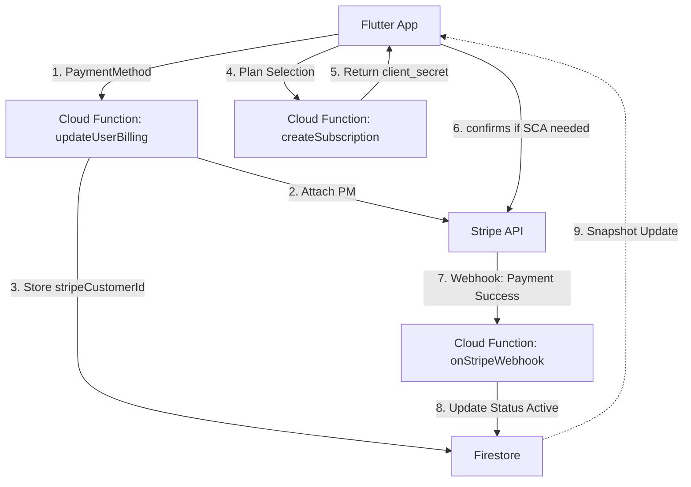

# Stripe Subscription Integration Design

## Objective
To implement a robust, secure recurring billing system using Stripe and Firebase Cloud Functions. The flow allows users to securely provide billing information first, followed by selecting and activating a subscription plan that charges the previously saved payment method.

## 1. User Flow
1.  **Billing Setup**:
    *   User enters card details in the Flutter app using Stripe's `CardField`.
    *   The Flutter app tokenizes the card via Stripe SDK to create a `PaymentMethod`.
    *   The app calls the `updateUserBilling` Cloud Function with the `PaymentMethod ID`.
2.  **Backend Billing Registration**:
    *   The Cloud Function creates or retrieves a Stripe `Customer` associated with the user's UID.
    *   The `PaymentMethod` is attached to the Stripe `Customer`.
    *   The `PaymentMethod` is set as the customer's `default_payment_method` for future invoices.
    *   The `stripeCustomerId` is stored in the user's Firestore document.
3.  **Subscription Selection**:
    *   User selects a plan (e.g., Pro, Enterprise) in the app.
    *   The app calls the `createSubscription` Cloud Function with the selected `Plan ID`.
4.  **Backend Subscription Activation**:
    *   The Cloud Function retrieves the user's `stripeCustomerId` from Firestore.
    *   It creates a Stripe `Subscription` using the customer ID and the Stripe `Price ID` corresponding to the chosen plan.
    *   **Synchronous Response**: The function returns the `latest_invoice.payment_intent` details (including `client_secret`) to the Flutter app.
5.  **Payment Confirmation & SCA**:
    *   If the payment requires 3D Secure (SCA), the Flutter app uses the `client_secret` to call `Stripe.instance.confirmPayment`.
    *   **UI Feedback**: The UI shows a "Processing Payment..." overlay during this time.
6.  **Status Sync (Webhooks)**:
    *   Stripe sends a webhook event (e.g., `invoice.paid`).
    *   A Cloud Function handles the webhook and updates the user's `subscriptionStatus` to `active` in Firestore.
    *   **Real-time Update**: The Flutter app, which is listening to Firestore snapshots, automatically dismisses the loading state and shows the "Success" UI once the status turns `active`.

## 2. Architecture

## 3. Data Schema Changes

### Advisor Model (Firestore)
- `stripeCustomerId`: String (optional) - The unique ID for the Stripe customer.
- `subscriptionId`: String (optional) - The active Stripe subscription ID.
- `subscriptionStatus`: String - 'active', 'past_due', 'canceled', 'incomplete', 'none'.
- `stripePriceId`: String - The Stripe Price ID currently being billed.

## 4. Implementation Tasks

### Phase 1: Backend (Cloud Functions)
- [ ] **Stripe SDK Setup**: Install `stripe` node package in `functions/`.
- [ ] **updateUserBilling Implementation**:
    - [ ] Create/Retrieve Stripe Customer.
    - [ ] Attach `paymentMethodId` to Customer.
    - [ ] Update Customer `invoice_settings.default_payment_method`.
    - [ ] Update Firestore with `stripeCustomerId`.
- [ ] **createSubscription Implementation**:
    - [ ] Define Plan-to-PriceID mapping (Environment variables).
    - [ ] Create Stripe Subscription with `customer` and `items[price]`.
    - [ ] Handle `incomplete` status for 3D Secure or failed initial payments.
    - [ ] Return `payment_intent.client_secret`.
- [ ] **onStripeWebhook Implementation**:
    - [ ] Validate Stripe Signature.
    - [ ] Handle `invoice.paid` and `invoice.payment_failed`.
    - [ ] Handle `customer.subscription.deleted` (cancellation).
    - [ ] Handle `customer.subscription.updated`.

### Phase 2: Frontend (Flutter)
- [ ] **Advisor Model Update**: Add Stripe-specific fields to `Advisor` class and Hive adapter.
- [ ] **Billing Service Enhancement**:
    - [ ] Implement `createSubscription` call.
    - [ ] Implement `handleScaConfirmation(String clientSecret)` wrapper using `Stripe.instance.confirmPayment`.
- [ ] **Advisor Provider Enhancement**:
    - [ ] Add `subscribeToPlan(String planName)` method.
    - [ ] Add `isProcessingPayment` boolean flag for UI feedback.
- [ ] **Settings View UI**:
    - [ ] Add a `LoadingOverlay` or `CircularProgressIndicator` that triggers when `isProcessingPayment` is true.
    - [ ] Implement a real-time listener on the advisor's document status.
    - [ ] Show "Success" animation/notification once `subscriptionStatus` is updated to `active` via Firestore snapshots.

### Phase 3: Stripe Dashboard Configuration
- [ ] Create Products and Prices (Starter, Pro, Enterprise).
- [ ] Configure Webhook endpoint URL pointing to the Cloud Function.
- [ ] Obtain Secret Key and Webhook Secret for Cloud Function config.

## 5. Security Considerations
- **No Private Keys in App**: Stripe Secret Key must only exist in Cloud Function environment variables.
- **Webhook Verification**: Always verify the Stripe signature to prevent spoofing.
- **Idempotency**: Use idempotency keys for creating subscriptions to prevent double-charging on retries.
